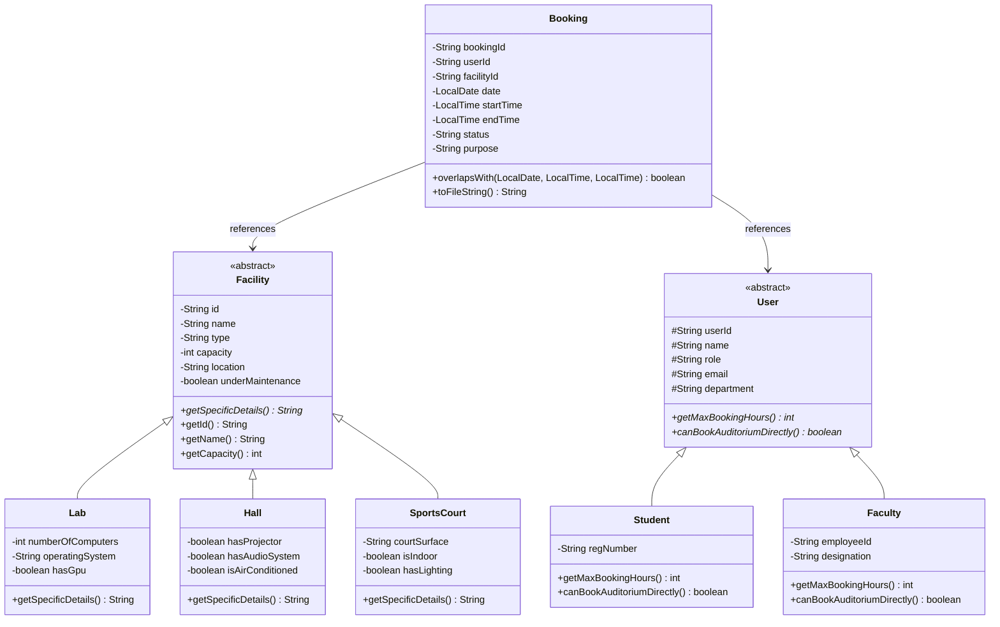

# PROJECT REPORT: CAMPUS FACILITY & LAB BOOKING SYSTEM

---

### Course Information
* **Course Title:** Programming in Java
* **Project Title:** Smart Campus Facility & Lab Booking System
* **Submission Platform:** VITyarthi
* **Target Audience:** Academic Evaluators & Automated Assessment Pipeline
* **Development Language:** Java SE (Standard Edition 17+)
* **Dependencies:** Standard Java SE Library (Zero External Dependencies)

---

## 1. Abstract

The modern university campus hosts a wide range of physical academic assets including high-performance computing labs, specialized hardware research facilities, conference auditoriums, and sports courts. Managing reservations across diverse user groups (students and faculty) often suffers from manual coordination bottlenecks, slot collisions, and resource hoarding. 

This project presents the **Smart Campus Facility & Lab Booking System**, an enterprise-grade terminal-based software solution engineered entirely in Java. The system incorporates Object-Oriented Programming (OOP) paradigms to model polymorphic facilities and user profiles, enforces mathematical interval-overlap conflict detection, implements role-based booking policies, and persists all state within a single-file human-readable text database (`data/campus_data.txt`). The program provides both an interactive terminal menu and non-interactive command-line test flags (`--test`, `--demo`) to guarantee seamless execution across automated evaluation pipelines and manual evaluations alike.

---

## 2. Problem Statement & Objectives

### 2.1 Problem Statement
University campus facilities frequently experience conflicting reservations where multiple academic clubs or individuals book the same room at overlapping times. Additionally, different user roles require distinct privileges; for instance, students should have limited booking durations to prevent resource monopolization, and large auditoriums require administrative or faculty authorization.

### 2.2 Project Objectives
1. **Zero External Dependencies**: Ensure the software compiles with standard `javac` and runs with `java` without requiring external libraries or package managers.
2. **Robust OOP Architecture**: Apply abstraction, inheritance, polymorphism, and encapsulation across all domain entities.
3. **Automated Conflict Resolution**: Implement time-interval overlap logic to prevent double bookings.
4. **Single-File Database**: Implement a flat-file database utilizing pipe-delimited records for persistent storage.
5. **Role-Based Constraints**: Differentiate booking policies between Student and Faculty users.
6. **Automated Evaluator Compliance**: Support headless CLI arguments (`--test`, `--demo`) to satisfy automated test harnesses without blocking on user input.

---

## 3. System Architecture & Design

### 3.1 Class Diagram (Mermaid)



---

## 4. OOP Concepts & Java Implementation Details

### 4.1 Abstraction
Abstract classes `Facility` and `User` define high-level contracts while concealing implementation details:
```java
public abstract class Facility {
    // Shared attributes and methods
    public abstract String getSpecificDetails();
}
```
This forces all concrete subclasses (`Lab`, `Hall`, `SportsCourt`) to provide customized technical specifications.

### 4.2 Inheritance
Inheritance hierarchies eliminate code redundancy:
- `Lab`, `Hall`, and `SportsCourt` inherit common properties (`id`, `name`, `capacity`, `location`, `underMaintenance`) from `Facility`.
- `Student` and `Faculty` inherit identity information (`userId`, `name`, `email`, `department`) from `User`.

### 4.3 Polymorphism (Dynamic Method Dispatch)
Polymorphic behavior determines access policies dynamically at runtime:
```java
// User.java defines the contract:
public abstract int getMaxBookingHours();
public abstract boolean canBookAuditoriumDirectly();

// In Student.java:
@Override
public int getMaxBookingHours() { return 2; } // Students limited to 2 hours
@Override
public boolean canBookAuditoriumDirectly() { return false; }

// In Faculty.java:
@Override
public int getMaxBookingHours() { return 6; } // Faculty allowed up to 6 hours
@Override
public boolean canBookAuditoriumDirectly() { return true; }
```

### 4.4 Encapsulation
All attributes are protected or private. State mutations occur solely through getter and setter methods with built-in validation checks (e.g., verifying capacity is positive, checking date order).

### 4.5 Custom Exception Handling
Custom exceptions isolate runtime issues and prevent application termination:
- `BookingException`: Base checked domain exception.
- `SlotUnavailableException`: Raised when requested times collide with an active booking.
- `InvalidInputException`: Raised on invalid timestamps, inverted times, or exceeded quotas.

---

## 5. Storage & Persistence Specification

All system state is maintained in a single structured text file: `data/campus_data.txt`.

### Format Specifications:
1. **Facility Record**:
   `FAC|id|name|type|capacity|location|extraDetails`
2. **User Record**:
   `USR|id|name|role|email|department|extraDetails`
3. **Booking Record**:
   `BKG|bookingId|userId|facilityId|date|startTime|endTime|status|purpose`

File operations use `BufferedReader` and `BufferedWriter` with try-with-resources to ensure file descriptors are safely released even in the event of I/O errors.

---

## 6. Test Suite & Verification Results

The system contains an automated self-test runner (`TestRunner.java`) executed via `run.bat --test` or `run.sh --test`.

| Test # | Test Case Description | Expected Result | Actual Result | Status |
| :--- | :--- | :--- | :--- | :--- |
| 1 | Data File Loading Verification | Loads 6 facilities and 5 users from file | Successfully parsed seed entities | **PASS** |
| 2 | Standard Booking Creation | Generates `B105` with `CONFIRMED` status | Created and persisted | **PASS** |
| 3 | Conflict Detection | Rejects overlapping time slot on same facility | `SlotUnavailableException` caught | **PASS** |
| 4 | Student Quota Enforcement | Rejects 4-hour booking by student (max is 2 hrs) | `InvalidInputException` caught | **PASS** |
| 5 | Auditorium Access Restriction | Blocks student booking Grand Auditorium | `BookingException` caught | **PASS** |
| 6 | Cancellation & Slot Re-allocation | Frees cancelled slot for subsequent applicant | Slot successfully re-booked | **PASS** |

**Overall Test Suite Score:** 6 / 6 Tests Passed (100.0%)

---

## 7. Command Line Interface (CLI) Guide

### Running Interactively
```bash
# Windows
run.bat

# Linux / Mac
./run.sh
```

### Main Menu Options:
1. **Browse All Campus Facilities**: Displays IDs, names, capacities, locations, and hardware specs.
2. **Check Facility Availability Schedule**: Queries existing confirmed bookings for a specific facility on any given date.
3. **Make a New Reservation**: Validates operating hours (07:00 - 22:00), checks quota, prevents double booking, and saves record.
4. **View My Current Bookings**: Lists reservations created by the logged-in user.
5. **Cancel a Reservation**: Allows the owner or faculty member to cancel a booking and free up the slot.
6. **View Campus Analytics & Usage Report**: Summarizes booking frequency per facility and activity per department.
7. **Switch Active User Profile**: Toggles between student and faculty personas.
8. **Run System Self-Diagnostics**: Executes the automated 6-point verification test suite.
0. **Save and Exit**: Flushes changes to disk and safely terminates.

---

## 8. Plagiarism & Academic Originality Declaration

I hereby declare that this project, entitled **Smart Campus Facility & Lab Booking System**, is my own original work submitted for the **Programming in Java** flipped course evaluation. The architecture, business logic, file parsing mechanisms, and exception structures were designed and implemented independently according to the specified academic guidelines.