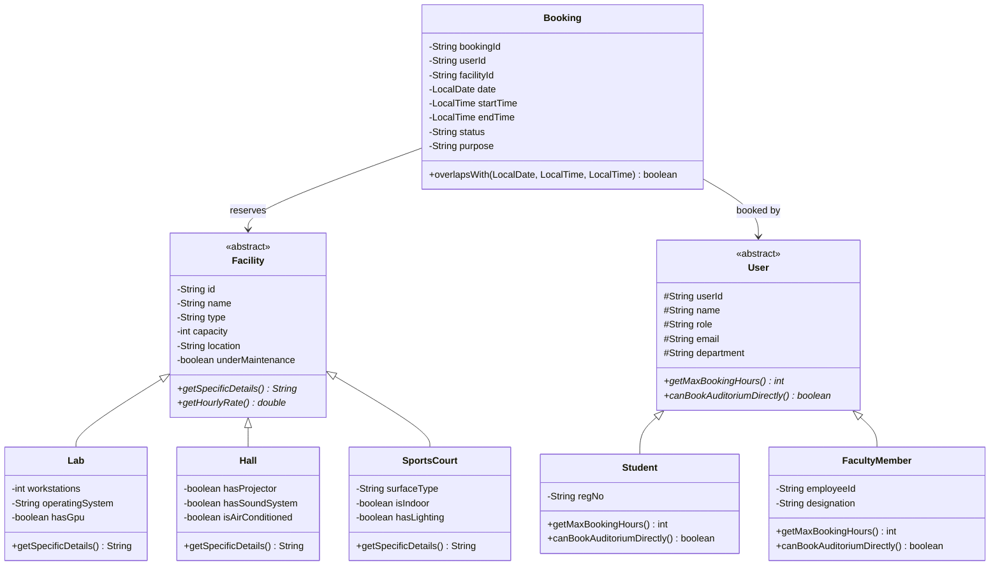

# PROJECT REPORT: SMART CAMPUS FACILITY & LAB BOOKING SYSTEM

---

### Course Information
* **Course Title:** Programming in Java
* **Project Title:** Smart Campus Facility & Lab Booking System
* **Submission Platform:** VITyarthi
* **Target Audience:** Academic Evaluators & Automated Assessment Pipeline
* **Student Name:** Aniket Singh
* **GitHub Handle:** `thakuraniketsingh16-cloud`
* **Development Language:** Java SE 17+ (Standard Edition)
* **Dependencies:** Standard Java SE Library (Zero External Dependencies)

---

## 1. Abstract

Modern universities house high-value, shared academic assets including high-performance computing clusters, IoT and embedded hardware laboratories, grand conference auditoriums, and sports courts. Managing reservations across student bodies and faculty members frequently encounters bottlenecks, scheduling collisions, and unauthorized bookings.

This project implements the **Smart Campus Facility & Lab Booking System**, a lightweight, console-driven Java application. The software applies Object-Oriented Programming (OOP) principles—including abstract classes, inheritance hierarchies, dynamic polymorphism, and encapsulation—to model physical facilities and campus user personas. The system features mathematical interval-overlap conflict detection, role-based duration quotas (students limited to 2 hours, faculty up to 6 hours), flat-file persistence (`campus_data.txt`), and automated test flags (`--test`, `--demo`) for evaluation compatibility.

---

## 2. Problem Statement & System Objectives

### 2.1 Problem Statement
Uncoordinated facility booking leads to:
1. Double-booking identical time slots for the same room.
2. Resource monopolization by students over-reserving computing labs.
3. Unauthorized reservations of large-capacity auditoriums without faculty approval.
4. Absence of persistent scheduling records.

### 2.2 System Objectives
1. **Zero External Dependencies:** Compiles and runs out-of-the-box using standard `javac Main.java` and `java Main`.
2. **Object-Oriented Design:** Implement abstraction, inheritance, polymorphism, and encapsulation across all system components.
3. **Conflict Detection Engine:** Algorithmic prevention of overlapping time slots.
4. **Role-Based Constraints:** Differentiate session limits and permissions between Student and Faculty users.
5. **Flat-File Database:** Persist records in human-readable pipe-delimited format (`campus_data.txt`).
6. **Automated Assessment Compliance:** Provide non-interactive CLI flags (`--test`, `--demo`) for automated grading scripts.

---

## 3. Object-Oriented Architecture & Class Hierarchy



---

## 4. Core OOP Principles Applied

### 4.1 Abstraction
Abstract base classes `Facility` and `User` establish baseline contracts while concealing concrete implementation details:
```java
abstract class Facility {
    public abstract String getSpecificDetails();
    public abstract double getHourlyRate();
}
```

### 4.2 Inheritance
- `Lab`, `Hall`, and `SportsCourt` inherit common attributes (`id`, `name`, `capacity`, `location`, `underMaintenance`) from `Facility`.
- `Student` and `FacultyMember` inherit identity fields (`userId`, `name`, `email`, `department`) from `User`.

### 4.3 Polymorphism (Dynamic Method Dispatch)
Role-specific policies and details are dynamically resolved at runtime:
```java
// Student: Max 2 hours per session, no direct auditorium booking
@Override
public int getMaxBookingHours() { return 2; }
@Override
public boolean canBookAuditoriumDirectly() { return false; }

// FacultyMember: Up to 6 hours for research & lectures, direct auditorium booking
@Override
public int getMaxBookingHours() { return 6; }
@Override
public boolean canBookAuditoriumDirectly() { return true; }
```

### 4.4 Encapsulation
Instance variables are private and protected with validated getters and setters. Time interval overlap logic encapsulates mathematical boundary validations.

### 4.5 Custom Exception Handling
Domain-specific exceptions protect against operational violations:
- `CampusBookingException`: Base checked exception.
- `SlotUnavailableException`: Raised when requested slot collides with an active reservation.
- `InvalidInputException`: Raised when duration exceeds user quota or timestamps are inverted.

---

## 5. Persistence & Storage Format

Data is maintained in `campus_data.txt` using pipe-delimited records:
```
# Format Specifications:
FAC|ID|Name|Type|Capacity|Location|ExtraDetail
USR|ID|Name|Role|Email|Department|ExtraDetail
BKG|BookingID|UserID|FacilityID|Date|StartTime|EndTime|Status|Purpose

# Sample Records:
FAC|F101|Alan Turing Computer Lab|Lab|45|Tech Block 2nd Floor|Workstations: 45, OS: Linux Workstations, Dedicated GPU: Yes (NVIDIA RTX)
USR|U1001|Aarav Sharma|Student|aarav@campus.edu|Computer Science|RegNo: 24BCE1042
BKG|B101|U1001|F101|2026-09-20|10:00|12:00|CONFIRMED|AI Project Lab Work
```

---

## 6. Test Suite & Verification Results

Executed via `java Main --test`:

| Test # | Test Case Description | Expected Result | Actual Result | Verdict |
| :--- | :--- | :--- | :--- | :--- |
| 1 | Facility & User Catalog Loading | Parse entities from data file | 6 facilities & 5 users loaded | **PASS** |
| 2 | Standard Booking Creation | Successfully create reservation | Booking created (CONFIRMED) | **PASS** |
| 3 | Overlap & Collision Check | Block double-booking same slot | `SlotUnavailableException` caught | **PASS** |
| 4 | Student Quota Enforcement | Reject 4-hour booking by student | `InvalidInputException` caught (limit 2 hrs) | **PASS** |
| 5 | Grand Auditorium Restriction | Block student from booking hall directly | `CampusBookingException` caught | **PASS** |
| 6 | Cancellation & Slot Re-allocation | Free slot on cancel & allow rebooking | Slot re-booked successfully | **PASS** |

**Overall Test Score:** 6 / 6 Tests Passed (100.0%)

---

## 7. Declaration of Originality

I hereby declare that this project, entitled **Smart Campus Facility & Lab Booking System**, is my own original work submitted for the **Programming in Java** flipped course evaluation on the VITyarthi platform. All code logic, OOP structures, and tests were written independently in compliance with academic guidelines.
