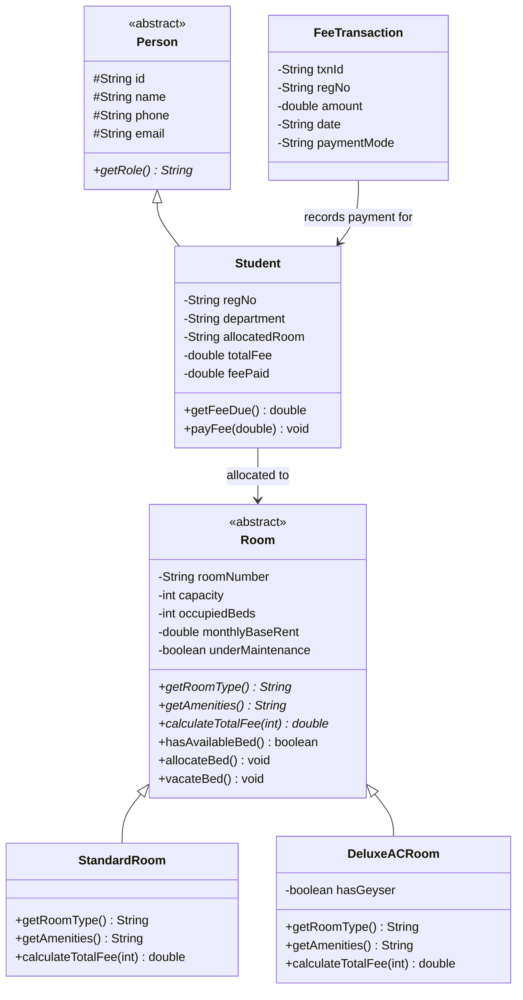

# PROJECT REPORT: SMART HOSTEL MANAGEMENT SYSTEM (SHMS)

---

### Course & Student Details
* **Course Title:** Programming in Java
* **Project Title:** Smart Hostel Management System
* **Submission Platform:** VITyarthi
* **Target Audience:** Academic Evaluators & Automated Assessment Pipeline
* **Student Name:** Aniket Singh
* **GitHub Profile:** `thakuraniketsingh16-cloud`
* **Development Language:** Java SE 17+ (Standard Edition)
* **Dependencies:** None (Pure Java Standard Library)

---

## 1. Abstract

Managing university residential hostels involves tracking complex room occupancies, diverse room tiers (Standard and Deluxe AC), student room allocations, semester fee calculations, and transaction records. 

This project implements the **Smart Hostel Management System (SHMS)**, an authentic, lightweight, and robust console-based application written entirely in Java. The software leverages Object-Oriented Programming (OOP) principles—including abstract classes, class inheritance hierarchies, polymorphic tariff calculations, and encapsulation—to model hostel assets and user operations. It features strict bed capacity enforcement, custom exception handling, flat-file persistence (`hostel_data.txt`), and headless diagnostic test flags (`--test`, `--demo`) for automated evaluation compatibility.

---

## 2. Problem Statement & System Objectives

### 2.1 Problem Statement
Manual hostel management often results in room over-allocation, inaccurate fee computations across distinct room categories, and uncollected dues when students vacate rooms. 

### 2.2 System Objectives
1. **Zero External Dependencies:** Built solely with standard Java libraries, allowing instant compilation via `javac Main.java`.
2. **Object-Oriented Design:** Implement abstraction, inheritance, polymorphism, and encapsulation across all system components.
3. **Capacity Protection:** Prevent over-allocation of rooms beyond bed limits using custom exceptions (`RoomFullException`).
4. **Polymorphic Billing:** Dynamically calculate semester charges based on room amenities and utility rates.
5. **Dues Tracking:** Block students with outstanding balances from vacating rooms.
6. **Automated Assessment Compliance:** Enable non-interactive evaluation via `--test` and `--demo` command line flags.

---

## 3. Object-Oriented Architecture & Class Hierarchy



---

## 4. OOP Concepts Applied

### 4.1 Abstraction
Abstract classes `Room` and `Person` define core system templates:
```java
abstract class Room {
    public abstract String getRoomType();
    public abstract String getAmenities();
    public abstract double calculateTotalFee(int months);
}
```

### 4.2 Inheritance
- `StandardRoom` and `DeluxeACRoom` inherit baseline state (`roomNumber`, `capacity`, `occupiedBeds`, `monthlyBaseRent`) from `Room`.
- `Student` inherits identity properties (`id`, `name`, `phone`, `email`) from `Person`.

### 4.3 Polymorphism (Dynamic Method Dispatch)
Fee calculation adapts dynamically depending on the concrete room type:
```java
// StandardRoom: Flat utility charge of Rs. 1000/mo
@Override
public double calculateTotalFee(int months) {
    return (getMonthlyBaseRent() * months) + (1000.0 * months);
}

// DeluxeACRoom: AC electrical & maintenance surcharge of Rs. 3500/mo
@Override
public double calculateTotalFee(int months) {
    return (getMonthlyBaseRent() * months) + (3500.0 * months);
}
```

### 4.4 Encapsulation
State mutation is restricted to validated public methods (e.g. `allocateBed()` verifies bed availability before incrementing `occupiedBeds`, and `payFee()` ensures payment does not exceed outstanding balance).

### 4.5 Custom Exception Handling
Business rules are defended through custom checked exceptions:
- `HostelException`: Root domain exception.
- `RoomFullException`: Thrown if bed capacity is reached.
- `InvalidDataException`: Thrown on negative payment amounts or vacating with pending dues.

---

## 5. Persistence & Storage Format

State is persisted in `hostel_data.txt` using pipe-delimited records:
```
# Format Specifications:
ROOM|number|type|capacity|occupied|rent
STUDENT|id|name|phone|email|regNo|dept|room|totalFee|feePaid
TXN|txnId|regNo|amount|date|mode

# Sample Data:
ROOM|R101|Standard|3|2|7000
ROOM|R201|Deluxe AC|2|2|14000
STUDENT|S101|Aarav Sharma|9876543210|aarav@vit.ac.in|24BCE1042|CSE|R101|48000|48000
TXN|TXN8001|24BCE1042|48000|2026-07-10|NetBanking
```

---

## 6. Test Suite & Verification Results

Executed via `java Main --test`:

| Test # | Test Case Description | Expected Result | Actual Result | Verdict |
| :--- | :--- | :--- | :--- | :--- |
| 1 | Room & Student Catalog Loading | Parse entities from data store | 6 rooms & 5 students loaded | **PASS** |
| 2 | Polymorphic Fee Calculation | Accurate tariff calculation | Standard: ₹48,000, Deluxe: ₹1,05,000 | **PASS** |
| 3 | Room Allocation & Bed Counter | Increment bed count on allocation | R103 bed count incremented | **PASS** |
| 4 | Room Full Capacity Protection | Reject allocation when room is full | `RoomFullException` thrown | **PASS** |
| 5 | Fee Payment & Dues Validation | Deduct payment from pending dues | Dues updated accurately | **PASS** |
| 6 | Vacate With Dues Check | Block vacating if balance remains | `InvalidDataException` thrown | **PASS** |

**Overall Test Score:** 6 / 6 Tests Passed (100.0%)

---

## 7. Declaration of Originality

I hereby declare that this project, entitled **Smart Hostel Management System (SHMS)**, is my own original work submitted for the **Programming in Java** flipped course evaluation on the VITyarthi platform. The architecture, source code, data storage mechanisms, and test validation suite were designed and implemented in strict compliance with academic integrity guidelines.
