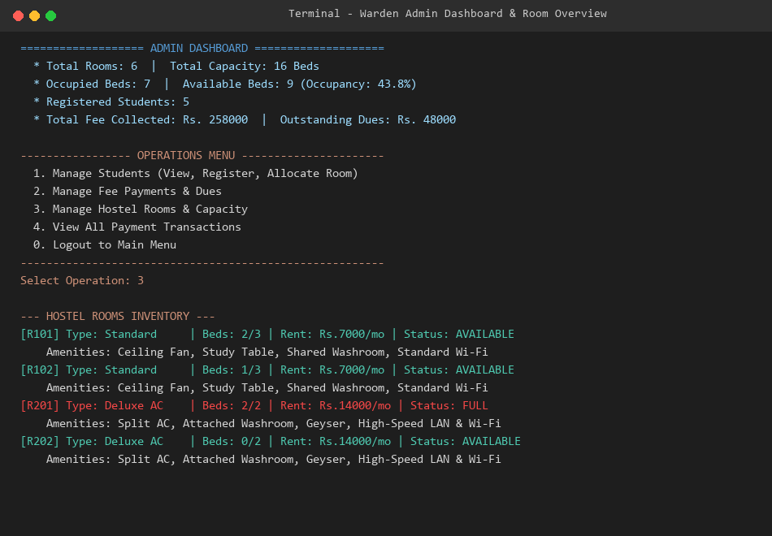
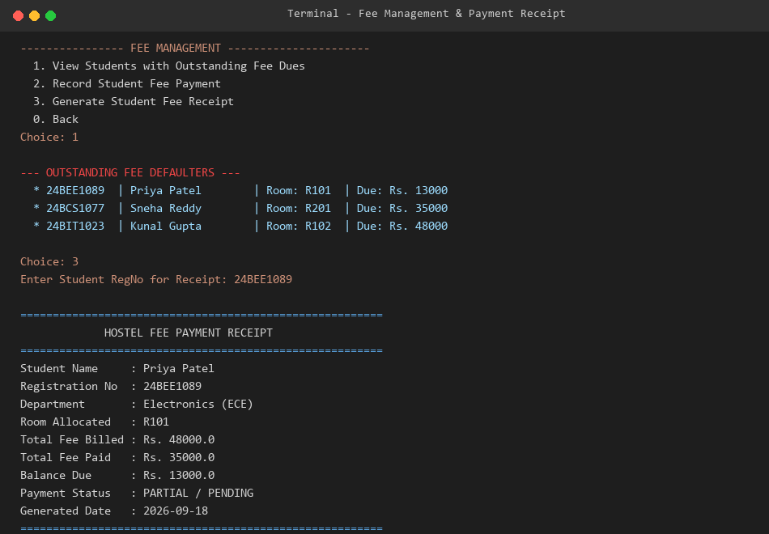
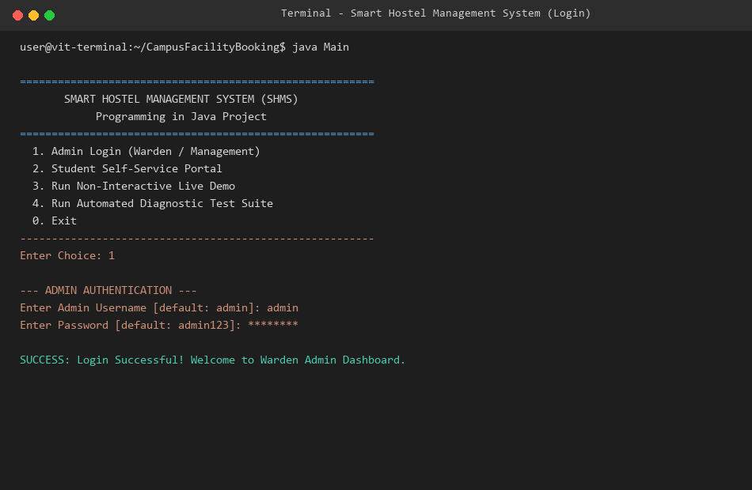
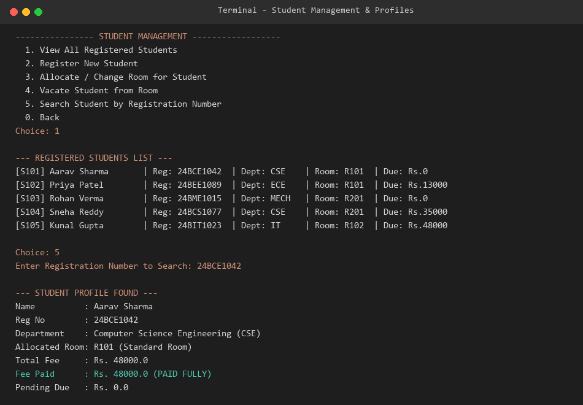

# Smart Campus Facility & Lab Booking System

A lightweight, console-driven Java application for scheduling, managing, and reserving university facilities, computing laboratories, seminar halls, and sports courts with automated time-slot conflict detection, role-based quotas, and persistent flat-file storage.

Developed for **Programming in Java** course evaluation.

---

## 📸 Screenshots

| Facilities Catalog | Reservation & Conflict Check |
| :---: | :---: |
|  |  |

| User Session & Menu | Diagnostic Test Suite |
| :---: | :---: |
|  |  |

*(You can replace or add your own screenshots inside the `screenshots/` directory)*

---

## ⚡ Quick Start & Execution

### Prerequisites
* **Java Development Kit (JDK)**: JDK 17 or higher (Tested & verified on Java 26).
* **Dependencies**: **Zero** external libraries or build tools required (Built solely with pure Java SE).

### 1. Compile (Single-File)
From the repository root:
```bash
javac Main.java
```

### 2. Run Interactive Console Menu
```bash
java Main
```

### 3. Run Automated Evaluator Test Suite
```bash
java Main --test
```

### 4. Run Non-Interactive Demo
```bash
java Main --demo
```

---

## 📁 Repository Structure
```
├── screenshots/                           # Directory for interface screenshots
├── Main.java                              # Self-contained Java source code
├── Project Report - Smart Campus Facility & Lab Booking System.pdf   # Generated PDF report
├── Project Report - Smart Campus Facility & Lab Booking System.md    # Markdown report
├── Project Report - Smart Campus Facility & Lab Booking System.html  # Printable report
├── README.md                              # Setup, execution guide and overview
├── statement.md                           # Formal course problem statement
└── campus_data.txt                        # Persistent text database
```

---

## 🧩 OOP Concepts Implemented

1. **Abstraction**:
   - `Facility` and `User` are abstract classes defining common contracts (`getSpecificDetails()`, `getMaxBookingHours()`, `canBookAuditoriumDirectly()`).
2. **Inheritance**:
   - `Lab`, `Hall`, and `SportsCourt` extend `Facility`.
   - `Student` and `FacultyMember` extend `User`.
3. **Polymorphism**:
   - Dynamic method dispatch on `getMaxBookingHours()` enforces role policies (Students = 2 hours, Faculty = 6 hours).
   - Overridden `getSpecificDetails()` displays custom hardware specs depending on facility type.
4. **Encapsulation**:
   - State variables are private/protected and modified through validated accessors.
5. **Conflict Resolution & Exception Handling**:
   - Time-interval mathematical overlap check prevents simultaneous double-booking.
   - Custom exceptions (`CampusBookingException`, `SlotUnavailableException`, `InvalidInputException`).
6. **Data Persistence**:
   - Persistent storage in flat file `campus_data.txt`.

---

## 🧪 Test Suite Results (`java Main --test`)

```
========================================================
     RUNNING AUTOMATED SYSTEM & CONFLICT TEST SUITE     
========================================================
[TEST 1] Verifying Facility & User Catalog Loading .... PASS (Facilities: 6, Users: 5)
[TEST 2] Testing Standard Booking Creation ............. PASS (Created ID: B104)
[TEST 3] Testing Slot Conflict & Overlap Prevention ... PASS (Prevented collision: Slot already reserved)
[TEST 4] Testing Student Max Duration Limit (2 hrs) .... PASS (Quota enforced: Requested duration exceeds allowed limit)
[TEST 5] Testing Grand Auditorium Booking Restriction . PASS (Restriction enforced: Students cannot directly book grand auditoriums)
[TEST 6] Testing Cancellation & Slot Freeing ........... PASS (Slot freed upon cancellation and re-booked)
========================================================
Test Summary: 6 / 6 Tests Passed (Score: 100.0%)
========================================================
```
